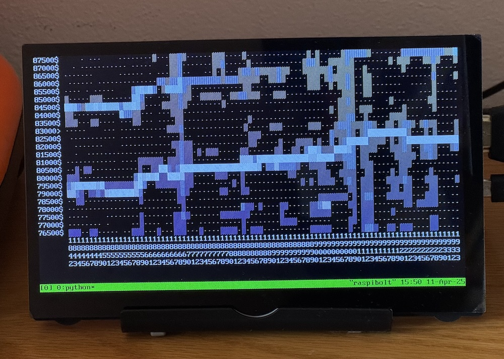
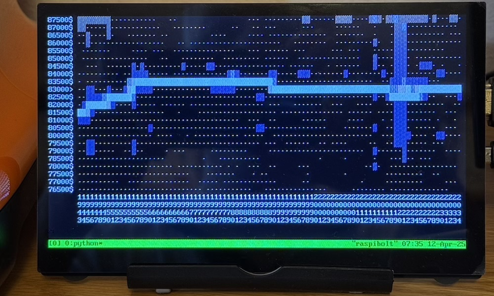
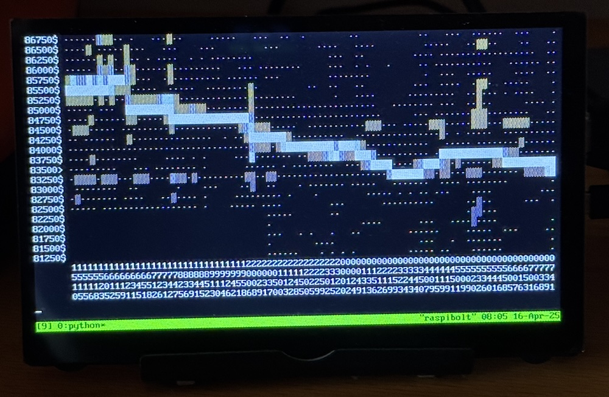
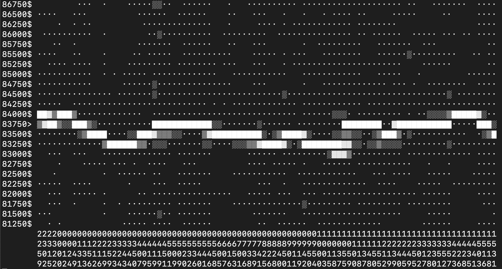

# UTXOscope
UTXOscope is a text-only BTC blockchain analysis tool that visualizes price dynamics using only on-chain data.
Unlike traditional methods that rely on external exchanges or price feeds, UTXOscope estimates the Bitcoin price trend by analyzing the value distribution of newly created UTXOs (Unspent Transaction Outputs) directly from the blockchain.

The general idea is inspired by UTXOracle by Simple Steve (see https://utxo.live/oracle/). 

The  project runs fully locally using your own Bitcoin Core node and bitcoin-cli.

## Core Idea
The fundamental assumption behind UTXOscope is that the most common transaction size for retail users is a round-number fiat purchase — typically $100.
By analyzing the frequency and distribution of UTXOs that correspond to the most typical purchase amounts (\$100, \$50 and \$200), it becomes possible to infer the historical price trend and track its movements over time.

## Features
- No external price feed — fully self-contained analysis using blockchain data.
- ASCII-based heatmap visualization directly in the terminal.
- Real-time update as new blocks are mined, can start N blocks in the past to fill the screen.
- Configurable price range and binning for different display resolutions.
- Optional x-axis labeling of timestamps in: Local time, UTC, or the current block height (last 4 digits).
- Automatic (beta) tracking of price when price movements exceed the displayed range.

## Usage
The tool connects to a local Bitcoin Core full node (bitcoin-cli) and scans recent blocks to build a heatmap of UTXO creation sizes.

python3 UTXOscope.py

Six parameters will be asked to the user, prompts should be self-explanatory.

Default parameters (hit enter at every request) are tuned for visualizing a price range around \$84,000 ± 3% on a standard 80x24 terminal window, starting from 70 blocks in the past to fill the screen. If you are using standard parameters, check that the first is at least compatible with current price, so with BTC real price of \$100.000 standard parameters will not work, try 100.000 ± 3%.

If too few lines are available on the terminal, the program will progressively reduce the percent range. 

Alternatively, it is possible to explore historical price dynamics by specifying a starting block and custom parameters.

## Examples
To explore price activity on a 80x24 terminal starting from April 2nd, 2025:

python3 UTXOscope.py 

Entering the six parameters (requested on five separate prompts at startup):

84000 5 500 3 89504 B

*(YouTube 30 sec demo with above parameters, click to play)*

This will process about one day of data in 15 minutes on bitcoin core setups like Raspibolt

(fig. 01 for a "cloudy" day, fig 02  for clearer skyes)

**Fig.01:** *Example of output running on a Raspibolt + output on a 7' HDMI LCD (100x30 chars). In this example, the weaker trend line above the main signal is probably coming from sales of OC sats for \$100, including 7-8% total fees (seller+service+miner), thus buying less sats for the buck and projecting a 7-8% higher BTC price. Vertical lines correspond with odd blocks containing mostly data/payload transactions (made with v.0.4.0). Update: this singnal 7-8% price + fee signal should be less visible from v.0.4.1 *

**Fig.02:** *90 blocks later, a sharper and cleaner profile: it depends on the day and the type of transactions / UTXOs (made with v.0.4.0).*

**Fig.03:** *The most informative y-axis resolution is 250$ dollars (third parameter), this example was launched on a 7' HDMI LCD (100x30 chars), but the tracking could get lost if the price changes more than +/-3% in 2-3 blocks. In this case the x axis is labeled with local time in hours. (made with v.0.4.0).*

**Fig.04:** *Similar to fig.03, but some time later and with a clearer signal (made with v.0.4.1 using signal lower/higher harmonics from \$200 and \$50 purchases).*

## Requirements
- Bitcoin Core full node with RPC access (bitcoin-cli).
- Python 3.x.

## Disclaimer
This is an experimental tool and a very preliminary release.

It will fail if Bitcoin Core stops or if unexpected parameters are entered by the user.

Nothing harmful should happen in any case, this is just a python script calling bitcoin-cli locally and doing some calculations.

